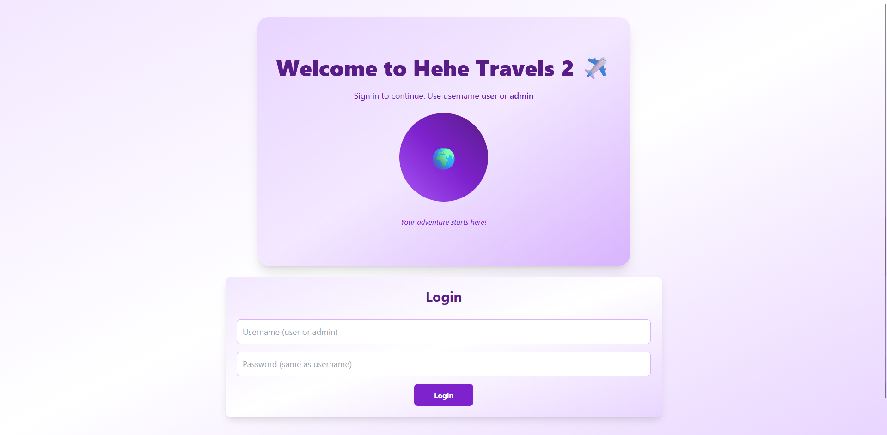
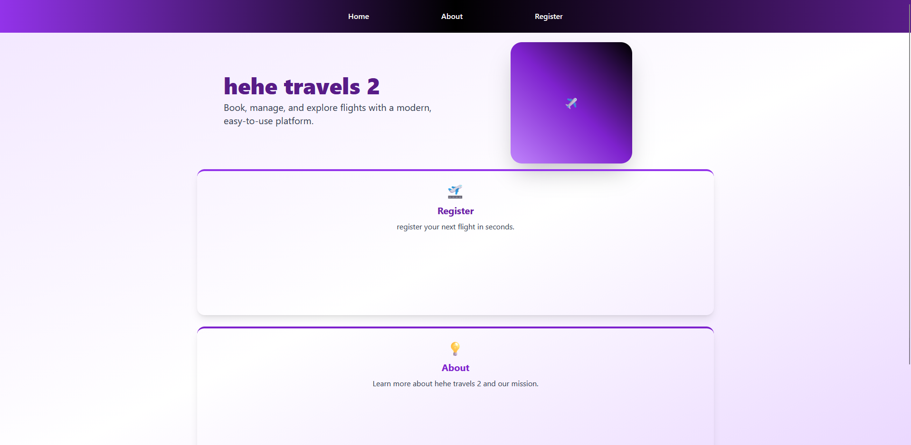
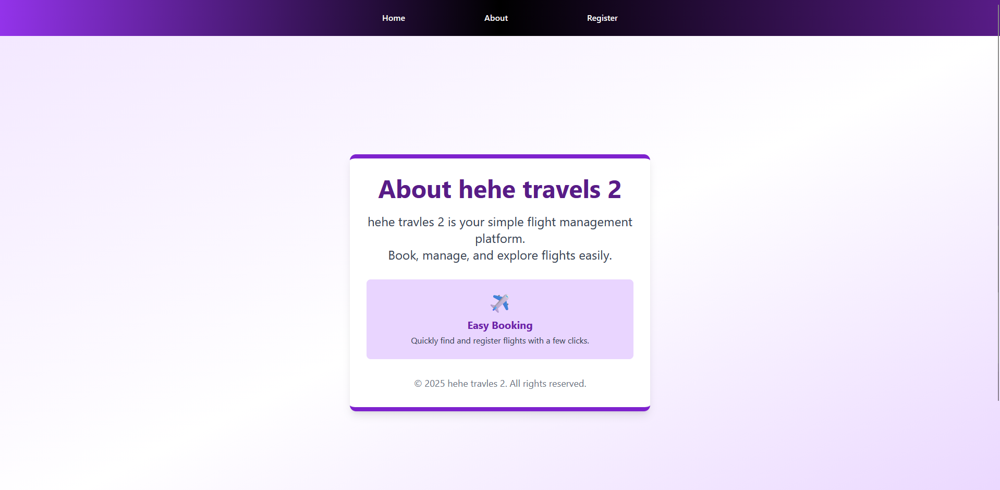
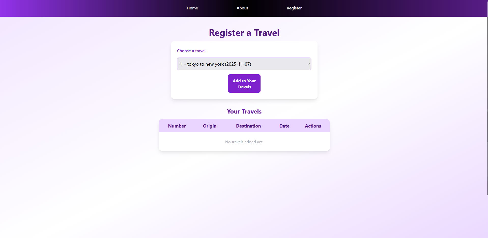
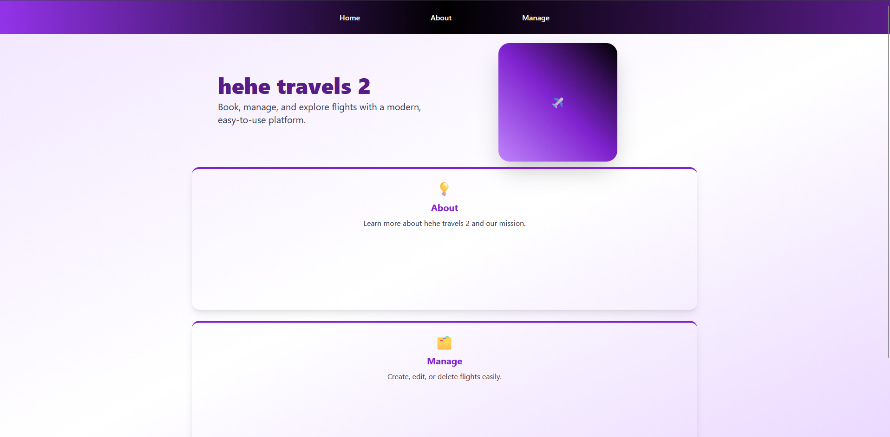
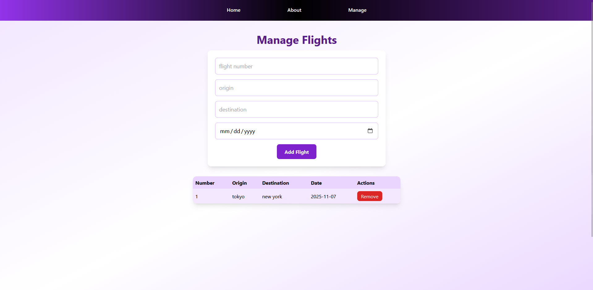
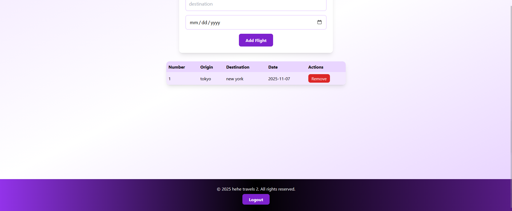

# hehe_project
csci426 project
# hehe travels 2 ✈️

A modern, role-based flight management application built with React and Tailwind CSS. Users can register flights, manage bookings, and admins can create and manage flight data.

## Project Description

**hehe travels 2** is a simple yet elegant flight management platform designed to demonstrate role-based access control and modern UI/UX principles. The application supports two user roles:

- **User**: Can view available flights, register for flights, and manage their travel bookings.
- **Admin**: Can create, edit, and manage flight data in a centralized dashboard.

### Key Features

- 🔐 **Role-Based Authentication**: Simple login with two roles (user/admin) with password validation
- 🎨 **Modern UI**: Clean, gradient-based design using Tailwind CSS
- 📱 **Responsive Design**: Fully responsive layout that works on desktop and mobile devices
- ✈️ **Flight Management**: Admins can add, edit, and delete flights
- 📋 **Travel Registration**: Users can browse and register for available flights
- 🔓 **Session Management**: Logout functionality with automatic redirect to login
- 🎯 **Role-Based Navigation**: Different UI elements and routes based on user role

## Tech Stack

- **Frontend**: React 18
- **Styling**: Tailwind CSS
- **Routing**: React Router v6
- **State Management**: React Context API
- **Build Tool**: Create React App

## Setup Instructions

### Prerequisites

- Node.js (v14 or higher)
- npm or yarn


### Login Credentials

The application uses hardcoded credentials for demonstration:

| Role  | Username | Password |
|-------|----------|----------|
| User  | `user`   | `user`   |
| Admin | `admin`  | `admin`  |


## Project Structure

```
src/
├── App.js                 # Main app component with routing and context providers
├── components/
│   ├── Login.jsx          # Login page with welcome section
│   ├── Navbar.jsx         # Navigation bar (role-based visibility)
│   ├── Footer.jsx         # Footer with logout button
│   ├── Home.jsx           # Landing page with feature cards
│   ├── About.jsx          # About page with app information
│   ├── Manage.jsx         # Flight management dashboard (admin only)
│   └── register.jsx       # Flight registration page (user only)
├── index.css              # Global styles
├── index.js               # React entry point
└── App.css                # App-level styles
```

## Features Overview

### 1. **Login Page** 
- Welcome section with app branding and instructions
- Simple form with username and password fields
- Error handling for invalid credentials
- Responsive stacked layout (welcome above form)

### 2. **Navbar**
- Navigation links that change based on user role
- "Register" link visible only to regular users
- "Manage" link visible only to admins
- Gradient background with hover effects

### 3. **Home Page**
- Hero section with app title and airplane graphic
- Feature cards for quick navigation
- Dynamic cards: users see "Register" and "About", admins see "Manage" and "About"
- Responsive grid layout

### 4. **Manage Flights** (Admin Only)
- Form to add new flights with fields:
  - Flight Number
  - Origin
  - Destination
  - Date
- Table displaying all flights with edit/delete actions
- Real-time updates using React Context

### 5. **Register Flights** (User Only)
- Dropdown selector with pre-filled flight options
- Add selected flights to personal travel list
- Table showing registered flights
- Remove option for each flight

### 6. **About Page**
- Information about the platform
- Feature highlights with emoji icons
- Clean, card-based layout

### 7. **Footer**
- Copyright information
- Logout button (visible when logged in)
- Consistent gradient styling with navbar

## UI Screenshots









## Authentication Flow

1. **Unauthenticated State**: User lands on login page
2. **Login**: Enter username and password (user or admin)
3. **Authenticated State**: Navbar appears, routes are available based on role
4. **Logout**: Click logout button in footer → redirected to login page

## State Management

### AuthContext
- Manages user authentication state
- Provides `login()` and `logout()` functions
- Consumed by: Navbar, Footer, Login, Home

### FlightsContext
- Manages global flights array
- Stores flight data for both Manage and Register components
- Provides `flights` and `setFlights` for shared state

## Responsive Design

- **Mobile**: Single-column layout, stacked components
- **Tablet**: Adjusted spacing and padding
- **Desktop**: Full-width layout with optimal spacing
- Uses Tailwind CSS breakpoints (`md:`, `lg:`) for responsive design

## Available Scripts

### `npm start`

Runs the app in development mode.
Open [http://localhost:3000](http://localhost:3000) to view it in your browser.

### `npm test`

Launches the test runner in interactive watch mode.

### `npm run build`

Builds the app for production to the `build` folder.
The build is minified and optimized for best performance.

### `npm run eject`

**Note: this is a one-way operation. Once you `eject`, you can't go back!**

## Future Enhancements

- 🔐 Backend authentication with JWT tokens
- 💾 Database integration (MongoDB, Firebase)
- 📧 Email notifications for flight bookings
- 🗺️ Real flight data integration (FlightRadar, Skyscanner API)
- 💳 Payment integration for flight bookings
- 📊 Admin analytics dashboard
- 🌙 Dark mode toggle
- 🌍 Multi-language support

## Troubleshooting

### Port 3000 already in use
```bash
# Windows PowerShell
netstat -ano | findstr :3000
taskkill /PID <PID> /F
```

### Dependencies issues
```bash
# Clear cache and reinstall
rm -rf node_modules package-lock.json
npm install
```

### Clear browser cache
Press `Ctrl + Shift + Delete` and select "All time" to clear cache.

## License

This project is open source and available under the MIT License.

---

**Enjoy hehe travels 2! ✈️🌍**
